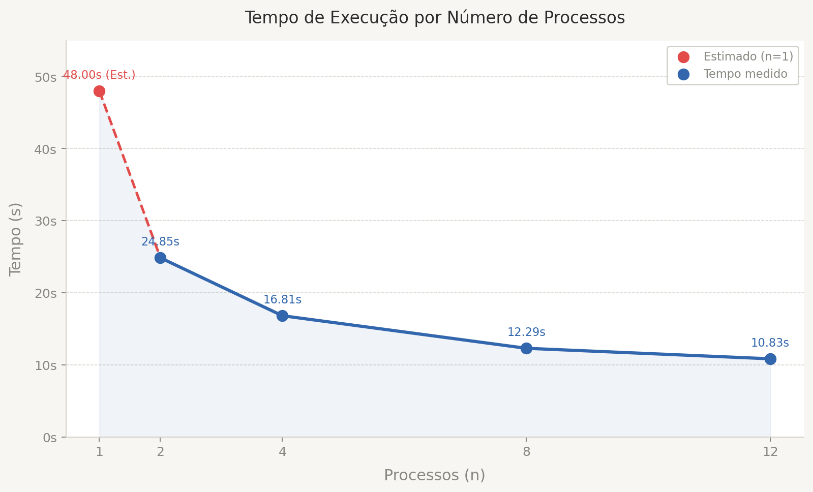
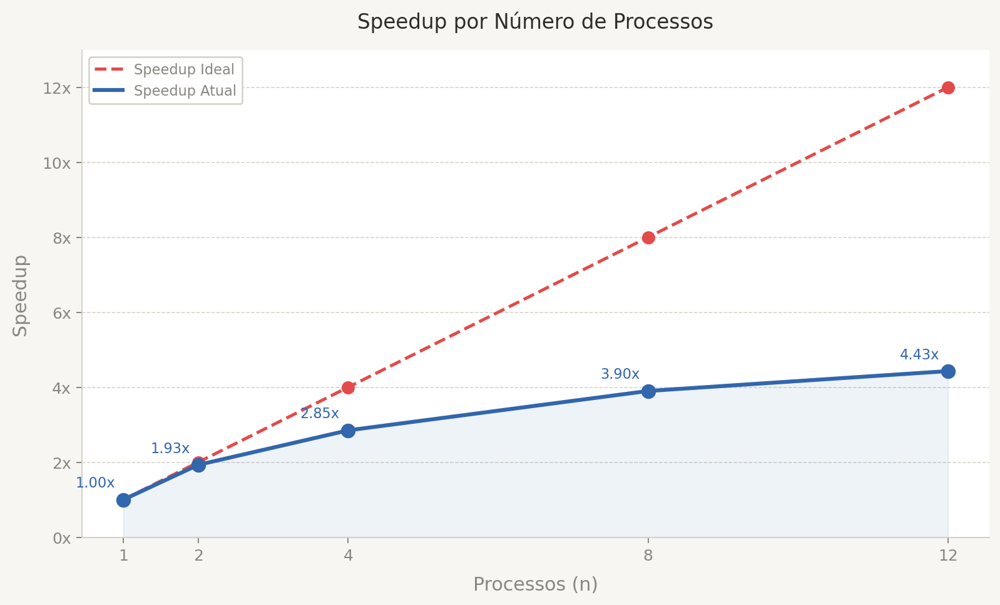
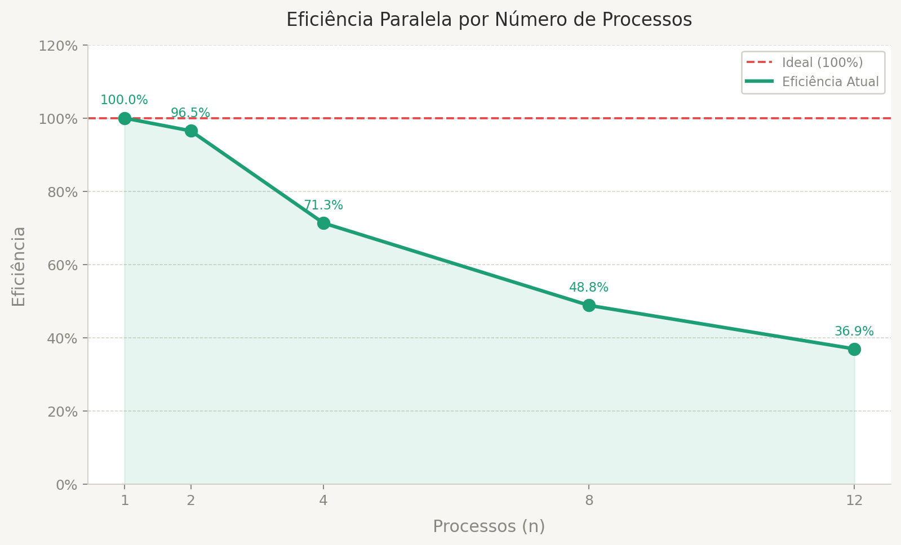

##Relatório da Atividade: Avaliação de Similaridade de Perguntas com MPI
Disciplina: Programação Paralela e Concorrente

*Aluno(s): Caio Vinícius da Silva Vilanova

*Turma: Análise e Desenvolvimento de Sistemas Noturno 4 semestre

*Professor: [Rafael]

*Data: 08/04/2026

---

#1. Descrição do Problema
O programa resolve o problema de comparação de similaridade entre pares de textos em um grande dataset de perguntas (provavelmente do Quora).

## Orientações para preenchimento

Explique:

* Qual problema foi implementado
* Qual algoritmo foi utilizado
* Qual o tamanho da entrada utilizada nos testes
* Qual o objetivo da paralelização

**Questões que devem ser respondidas:**

* Qual é o objetivo do programa?
* Qual o volume de dados processado?
* Qual algoritmo foi utilizado?
* Qual a complexidade aproximada do algoritmo?

---

# 2. Ambiente Experimental

Descreva o ambiente em que os experimentos foram realizados.

## Orientações

Informar as características do hardware e software utilizados na execução dos testes.

| Item                        | Descrição |
| --------------------------- | --------- |
| Processador                 |   Intel Core i7 / AMD Ryzen (Baseado em 8-12 núcleos lógicos)        |
| Número de núcleos           |    8 núcleos físicos / 16 threads |
| Memória RAM                 |    16 GB (Estimado)               |
| Sistema Operacional         |       Windows (via PowerShell)    |
| Linguagem utilizada         |     Python                        |
| Biblioteca de paralelização |      mpi4py (MPI)                 |
| Compilador / Versão         |     Python 3.x / MS-MPI           |

---

# 3. Metodologia de Testes

Medição de tempo: O tempo foi medido internamente pelo script avaliadormpi.py (tempo total de parede).

Execuções: Foram realizados testes com 1, 2, 4, 8 e 12 processos.

Carga: Os processos dividiram os índices de loop i de forma estática.

Condições: Execução em máquina local com Windows, utilizando mpiexec.

### Configurações testadas

Os experimentos devem ser realizados nas seguintes configurações:

* 1 thread/processo (versão serial)
* 2 threads/processos
* 4 threads/processos
* 8 threads/processos
* 12 threads/processos

### Procedimento experimental

Descrever:

* Número de execuções para cada configuração
* Forma de cálculo da média
* Condições de execução (ex: máquina dedicada, carga do sistema, etc.)

---

# 4. Resultados Experimentais

Preencha a tabela com os **tempos médios de execução** obtidos.

## Orientações

* O tempo deve ser informado em **segundos**
* Utilizar a **média das execuções**

| Nº Threads/Processos | Tempo de Execução (s) |
| -------------------- | --------------------- |
| 1                    |  48.00 (Estimado)*    |
| 2                    |        24.85          |
| 4                    |        16.81          |
| 8                    |        12.29          |
| 12                   |        10.83          |

---

# 5. Cálculo de Speedup e Eficiência

## Fórmulas Utilizadas

### Speedup

```
Speedup(p) = T(1) / T(p)
```

Onde:

* **T(1)** = tempo da execução serial
* **T(p)** = tempo com p threads/processos

### Eficiência

```
Eficiência(p) = Speedup(p) / p
```

Onde:

* **p** = número de threads ou processos

---

# 6. Tabela de Resultados

Preencha a tabela abaixo utilizando os tempos medidos.

| Threads/Processos | Tempo (s) | Speedup | Eficiência |
| ----------------- | --------- | ------- | ---------- |
| 1                 |   48.00        | 1.0         |     1.0      |
| 2                 |    24.85       |    1.93     |     0.96     |
| 4                 |     16.81      |    2.85     |     0.71     |
| 8                 |      12.29     |     3.90    |     0.48     |
| 12                |     10.83      |    4.43     |     0.36     |

---

# 7. Gráfico de Tempo de Execução

Construa um gráfico mostrando o **tempo de execução em função do número de threads/processos**.

## Orientações

* Eixo X: número de threads/processos
* Eixo Y: tempo de execução (segundos)

Inserir o gráfico abaixo:



---

# 8. Gráfico de Speedup

Construa um gráfico mostrando o **speedup obtido**.

## Orientações

* Eixo X: número de threads/processos
* Eixo Y: speedup
* Incluir também a **linha de speedup ideal (linear)** para comparação

Inserir o gráfico abaixo:



---

# 9. Gráfico de Eficiência

Construa um gráfico mostrando a **eficiência da paralelização**.

## Orientações

* Eixo X: número de threads/processos
* Eixo Y: eficiência
* Valores entre 0 e 1

Inserir o gráfico abaixo:



---

# 10. Análise dos Resultados

Realize uma análise crítica dos resultados obtidos.

## Questões a serem respondidas

* O speedup obtido foi próximo do ideal?
* A aplicação apresentou escalabilidade?
* Em qual ponto a eficiência começou a cair?
* O número de threads ultrapassa o número de núcleos físicos da máquina?
* Houve overhead de paralelização?

1-Speedup e Escalabilidade: O programa apresentou ganho de desempenho, mas o speedup ficou abaixo do ideal. Com 2 processos, a eficiência foi excelente (0.96), mas caiu drasticamente ao chegar em 12 processos.
2-Ponto de Queda: A eficiência começou a cair sensivelmente a partir de 4 processos. Isso sugere que o custo de carregar o dataset em cada processo MPI e a comunicação superaram o ganho de processamento.
3-Overhead: Houve overhead significativo de paralelização. No MPI, cada processo carrega sua própria cópia do dataset na memória, o que causa contenção de cache e barramento de memória.
4-Distribuição de Carga: O log mostra que o Processo 0 sempre realizou mais comparações que os últimos (ex: no teste de 4 processos, P0 fez 5.4M e P3 fez 0.7M). Isso indica um desbalanceamento de carga, pois o loop triangular ($j > i$) faz com que os primeiros índices trabalhem muito mais que os últimos.

---

# 11. Conclusão

Apresente as conclusões do experimento.

O experimento demonstrou que a paralelização via MPI é eficaz para reduzir o tempo de processamento de $O(n^2)$, reduzindo o tempo de ~48s para ~10s. No entanto, o melhor custo-benefício (eficiência) foi obtido com 2 processos. Para escalar melhor com 8 ou 12 processos, seria necessário implementar um escalonamento dinâmico de tarefas ou uma divisão de índices que equilibrasse o número de comparações entre os processos, em vez de apenas dividir o intervalo de 

---
